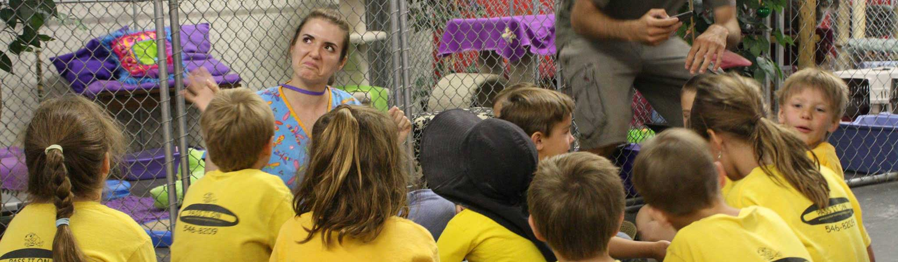

<!--<link rel="stylesheet" href="https://rawgit.com/dimsemenov/Magnific-Popup/master/dist/magnific-popup.css">
<link rel="stylesheet" href="../assets/css/gallery.css">
<link rel="stylesheet" href="../assets/css/gallery-images.css">-->

  Media craftswoman. 
  Has two cats and a houseplant. 
  Lover of digital design and graphic arts. 
  Web designer, illustrator, and research enthusiast. 
  Astro-hobbyist, classical flutist, gamer, and horrendous cook.

    

<!-- START EDUCATOR -->
<h3>Educator</h3>

800 hours Graduate Teaching Assistant, University of Montana 
135 hours Adjunct Professor, University of Montana 
200 hours Community-Based Education

  Lorem ipsum dolor sit amet, consectetur adipisicing elit. Labore dicta praesentium dolor asperiores nesciunt quod sapiente est minus, architecto corrupti, excepturi hic ipsa, saepe dignissimos similique ullam repudiandae rem voluptate. Ipsa iusto, voluptate doloremque facere expedita, molestias omnis facilis. Adipisci voluptatum, quia alias aut sint totam facere porro aperiam repellat ipsa? Odio ut sint dicta magnam molestias maiores eos impedit natus iste quas perspiciatis voluptas autem, illum qui aperiam labore necessitatibus incidunt, placeat reiciendis facilis iusto reprehenderit. Ad, quisquam, voluptatibus!

  Lorem ipsum dolor sit amet, consectetur adipisicing elit. Ipsa eaque error quos consequuntur totam, esse commodi magnam dignissimos explicabo modi.

Teaching about the importance of spay/neuter clinics to summer camp, ages 8-13 years.

<!-- END EDUCATOR -->

<!-- START MEDIA ARTS -->
<h3>Media Artist</h3>

BA, Media Arts, <i>em.</i> Digital Filmmaking 
MFA, Media Arts, <i>em.</i> Digital Techniques in the Arts

  Lorem ipsum dolor sit amet, consectetur adipisicing elit. Corrupti cum quibusdam eaque, autem porro fuga laudantium culpa beatae laboriosam quos.

  Lorem ipsum dolor sit amet, consectetur adipisicing elit. Ipsa eaque error quos consequuntur totam, esse commodi magnam dignissimos explicabo modi. Laborum temporibus enim eius quidem eum voluptatum eligendi. Nemo fuga at provident accusantium tempore eligendi alias sed! Provident veritatis adipisci deserunt. Totam repudiandae ducimus nemo aperiam assumenda. Odio quos, quam quod illum reiciendis sapiente doloremque quasi deserunt alias provident! Labore voluptatibus excepturi, ipsum et sint nihil delectus enim, commodi quis!

   Sorry, your browser does not support CSS Grid.

<section id="media-arts-gallery">
   

    <a href="https://images.pexels.com/photos/268261/pexels-photo-268261.jpeg?auto=compress&cs=tinysrgb&dpr=2&h=750&w=1260" title="Title for Image 1" class="magnific-image item item--small image-1">
      

        <!--First Item--><i class="fa fa-camera" aria-hidden="true"></i>
      

    </a>

       <a href="https://images.pexels.com/photos/93052/pexels-photo-93052.jpeg?auto=compress&cs=tinysrgb&dpr=2&h=750&w=1260" title="Title for Image 2" class="magnific-image item item--small image-2">
      

        <!--Second Item--><i class="fa fa-camera" aria-hidden="true"></i>
      

    </a>

    <a href="https://vimeo.com/210558372" title="Sunset View From Up Above" class="magnific-vimeo cap-video item item--small image-3">
      

        <!--Third Item--><i class="fa fa-video-camera" aria-hidden="true"></i>
      

    </a>

      <a href="#soundcloud" class="open-popup-link item item--small image-4">
      

        

          <iframe width="100%" height="166" scrolling="no" frameborder="no" allow="autoplay" src="https://w.soundcloud.com/player/?url=https%3A//api.soundcloud.com/tracks/209029946&color=%23bc8fc7&auto_play=false&hide_related=false&show_comments=true&show_user=true&show_reposts=false&show_teaser=true"></iframe>
          
<cite>nature_bump_000</cite>, comp. invention (2014)

        

      

      

        <!--Fourth Item--><i class="fa fa-headphones" aria-hidden="true"></i>
      

    </a>

    <a href="#extra-item" title="Sunset View From Up Above" class="open-popup-link item item--small image-5">
      

        

              <h2>Additional Content in Iframe</h2>
              
Lorem ipsum dolor sit amet, consectetur adipiscing elit.

              
              
Aliquam laoreet arcu id arcu aliquam, sit amet semper velit suscipit. Maecenas nulla neque, efficitur ac porta vel, sagittis sit amet tortor. Quisque volutpat sapien est, at dignissim mi suscipit eu. Integer cursus ac lectus sed lobortis. Class aptent taciti sociosqu ad litora torquent per conubia nostra, per inceptos himenaeos.

              
Suspendisse eu ex a sapien hendrerit euismod vel id risus. Etiam rhoncus eu mauris eget sollicitudin. Praesent varius justo at elit egestas porta. Phasellus vestibulum porttitor congue. Aenean sit amet faucibus eros. Sed consequat tristique nisi condimentum dignissim. Nulla dapibus, eros sed tincidunt semper, ipsum ex porttitor libero, at porta massa purus vel nunc. Maecenas lectus elit, cursus id posuere a, dictum eget mauris. Mauris sit amet consectetur est. Integer vitae diam mauris.

              <blockquote>Nullam volutpat venenatis vehicula. Pellentesque suscipit fermentum leo, at lacinia velit sollicitudin nec.</blockquote>
              
ulla commodo ex metus, a viverra dui volutpat sagittis. Sed non iaculis tortor. Nunc quis nibh vitae tellus iaculis efficitur. Sed non viverra ligula. Vestibulum eu cursus purus. In placerat posuere purus, quis luctus metus elementum sit amet. Cras ultrices consectetur metus. Sed pretium tempus volutpat. Nulla convallis ac orci sed pharetra. Donec tincidunt purus vel mauris accumsan fermentum. Maecenas faucibus, nisl quis varius volutpat, nibh odio dignissim est, quis laoreet eros quam sit amet nunc. Quisque vitae nibh metus. 

        

      

      

        <!--Fifth Item--><i class="fa fa-book" aria-hidden="true"></i>
      

    </a>

   

</section>
<!-- END MEDIA ARTS -->

<!-- START THEATRE -->
<h3>Theatre Technician</h3>

BA, Theatre, <i>em.</i> Design/Technology

  Lorem ipsum dolor sit amet, consectetur adipisicing elit. Labore dicta praesentium dolor asperiores nesciunt quod sapiente est minus, architecto corrupti, excepturi hic ipsa, saepe dignissimos similique ullam repudiandae rem voluptate. Ipsa iusto, voluptate doloremque facere expedita, molestias omnis facilis. Adipisci voluptatum, quia alias aut sint totam facere porro aperiam repellat ipsa? Odio ut sint dicta magnam molestias maiores eos impedit natus iste quas perspiciatis voluptas autem, illum qui aperiam labore necessitatibus incidunt, placeat reiciendis facilis iusto reprehenderit. Ad, quisquam, voluptatibus!

  Sorry, your browser does not support CSS Grid.

<section id="theatre-gallery">
   

    <a href="../assets/img/about/theatre-01-full.jpg" title="<cite>Gypsy</cite>, dir. Teresa Waldof, costume designer Wendy Stark Prey; Costume Technician" class="magnific-image item item--small theatre-01">
      

        <!--First Item--><i class="fa fa-camera" aria-hidden="true"></i>
      

    </a>

       <a href="https://images.pexels.com/photos/93052/pexels-photo-93052.jpeg?auto=compress&cs=tinysrgb&dpr=2&h=750&w=1260" title="Title for Image 2" class="magnific-image item item--small image-2">
      

        <!--Second Item--><i class="fa fa-camera" aria-hidden="true"></i>
      

    </a>

    <a href="https://images.pexels.com/photos/268261/pexels-photo-268261.jpeg?auto=compress&cs=tinysrgb&dpr=2&h=750&w=1260" title="Title for Image 3" class="magnific-image item item--small image-1">
      

        <!--Third Item--><i class="fa fa-camera" aria-hidden="true"></i>
      

    </a>

    <a href="https://www.youtube.com/watch?v=EK6EYT5b34k" title="<cite>Medea</cite>, dir. Deborah Voss; Videographer" class="magnific-youtube cap-video item item--small theatre-04">
      

        <!--Fourth Item--><i class="fa fa-video-camera" aria-hidden="true"></i>
      

    </a>

   

</section>
<!-- END THEATRE -->

<!-- START FINE ARTS -->
<h3>Traditional Artist and Historian</h3>

Minor, Art History and Criticism

  Lorem ipsum dolor sit amet, consectetur adipisicing elit. Vero laborum omnis iure cumque veritatis reiciendis, optio ad. Praesentium, illum. Deleniti ab rem laboriosam numquam natus explicabo sit cumque provident maxime.

  Sorry, your browser does not support CSS Grid.

<section id="fine-arts-gallery">
   

    <a href="../assets/img/about/fine-arts-01.jpg" title="&quot;Old Kyoto&quot;; Graphite and Charcol" class="magnific-image item item--small fine-arts-01">
      

        <!--First Item--><i class="fa fa-camera" aria-hidden="true"></i>
      

    </a>

       <a href="https://images.pexels.com/photos/93052/pexels-photo-93052.jpeg?auto=compress&cs=tinysrgb&dpr=2&h=750&w=1260" title="Title for Image 2" class="magnific-image item item--small image-2">
      

        <!--Second Item--><i class="fa fa-camera" aria-hidden="true"></i>
      

    </a>

    <a href="https://images.pexels.com/photos/268261/pexels-photo-268261.jpeg?auto=compress&cs=tinysrgb&dpr=2&h=750&w=1260" title="Title for Image 3" class="magnific-image item item--small image-3">
      

        <!--Third Item--><i class="fa fa-camera" aria-hidden="true"></i>
      

    </a>

    <a href="https://images.pexels.com/photos/268261/pexels-photo-268261.jpeg?auto=compress&cs=tinysrgb&dpr=2&h=750&w=1260" title="Title for Image 4" class="magnific-image item item--small image-4">
      

        <!--Fourth Item--><i class="fa fa-camera" aria-hidden="true"></i>
      

    </a>

   

</section>
<!-- END FINE ARTS -->

<!-- START MUSIC -->
<h3>My Life as an Instrumentalist</h3>

Performance and Arragnement

  Lorem ipsum dolor sit amet, consectetur adipisicing elit. Recusandae modi facilis vel distinctio itaque ea, commodi a autem, amet explicabo harum libero vero earum doloremque officiis, dolorum beatae soluta officia dignissimos. Ad odit ab, error illo! Iure numquam recusandae unde dignissimos aspernatur quia neque, voluptatibus ea, iste eaque corporis doloribus.

  Sorry, your browser does not support CSS Grid.

<section id="music-gallery">
   

    <a href="../assets/img/about/music-01.jpg" title="Performing Bass Flute with Jordon Plachecki" class="magnific-image item item--small music-01">
      

        <!--First Item--><i class="fa fa-camera" aria-hidden="true"></i>
      

    </a>

    <a href="#soundcloud-doppler" class="open-popup-link magnific-audio item item--small music-02">
      

        

          <iframe width="100%" height="166" scrolling="no" frameborder="no" allow="autoplay" src="https://w.soundcloud.com/player/?url=https%3A//api.soundcloud.com/tracks/209029946&color=%23bc8fc7&auto_play=false&hide_related=false&show_comments=true&show_user=true&show_reposts=false&show_teaser=true"></iframe>
          
<cite>Fantaisie Pastorale Hongroise, Op.26</cite>, comp. Franz Doppler (1870); Flute (Unaccompanied), Movement 1

        

      

      

        <!--Second Item--><i class="fa fa-headphones" aria-hidden="true"></i>
      

    </a>

    <a href="https://vimeo.com/96359735" title="<cite>Ebrio</cite>, dir. Paul John Alvarez (2008); Sound Design, Audio Arrangement, Performance" class="magnific-vimeo cap-video item item--small music-03">
      

        <!--Third Item--><i class="fa fa-video-camera" aria-hidden="true"></i>
      

    </a>

    <a href="#soundcloud-nishimura" class="open-popup-link magnific-audio item item--small music-04">
      

        

          <iframe width="100%" height="166" scrolling="no" frameborder="no" allow="autoplay" src="https://w.soundcloud.com/player/?url=https%3A//api.soundcloud.com/tracks/420471876&color=%230c9a9a&auto_play=false&hide_related=false&show_comments=true&show_user=true&show_reposts=false&show_teaser=true"></iframe>
          
<cite>Star Ship</cite>, comp. Yukiko Nishimura (2002); Solo Piccoloist

        

      

      

        <!--Fourth Item--><i class="fa fa-headphones" aria-hidden="true"></i>
      

    </a>

   

</section>
<!-- END MUSIC -->

